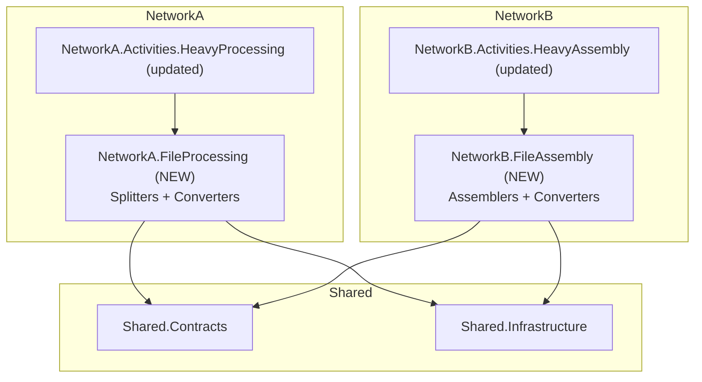

# File Processing Infrastructure Plan

## Target Architecture



---

## Step 1 — Create `NetworkA.FileProcessing` classlib

Path: `src/NetworkA/NetworkA.FileProcessing/`

Move from [`NetworkA.Activities.HeavyProcessing/Splitters/`](src/NetworkA/Activities/NetworkA.Activities.HeavyProcessing/Splitters/):

- `IFileSplitter.cs`
- `SplitRequest.cs`
- `DefaultFileSplitter.cs`
- `DocxFileSplitter.cs`
- `FileSplitterFactory.cs`

New files (converter abstraction, ready for future implementations):

- `Converters/IFileConverter.cs`

```csharp
public interface IFileConverter
{
    bool CanConvert(string fromExtension, string toExtension);
    Task<byte[]> ConvertAsync(ConvertRequest request);
}
```

- `Converters/ConvertRequest.cs` — record with `SourceFilePath`, `FromExtension`, `ToExtension`
- `Converters/DefaultFileConverter.cs` — pass-through (returns source bytes unchanged)
- `Converters/FileConverterFactory.cs` — same `IEnumerable<IFileConverter>` + `DefaultFileConverter` pattern as the splitter factory
- `Extensions/FileProcessingServiceExtensions.cs` — `AddFileSplitters()` and `AddFileConverters()` extension methods

Namespaces: `NetworkA.Activities.HeavyProcessing.Splitters` → `NetworkA.FileProcessing.Splitters`

Deps:

- `Shared.Contracts`
- `Shared.Infrastructure`
- `Aspose.Words` (moves here from the activity project)

---

## Step 2 — Create `NetworkB.FileAssembly` classlib

Path: `src/NetworkB/NetworkB.FileAssembly/`

Move from [`NetworkB.Activities.HeavyAssembly/Assemblers/`](src/NetworkB/Activities/NetworkB.Activities.HeavyAssembly/Assemblers/):

- `IFileAssembler.cs`
- `AssemblyRequest.cs` / `AssemblyChunk`
- `DefaultFileAssembler.cs`
- `DocsAssembler.cs`
- `FileAssemblerFactory.cs`

New files (converter abstraction, mirroring NetworkA):

- `Converters/IFileConverter.cs` — same interface shape as NetworkA (independent copy)
- `Converters/ConvertRequest.cs`
- `Converters/DefaultFileConverter.cs`
- `Converters/FileConverterFactory.cs`
- `Extensions/FileAssemblyServiceExtensions.cs` — `AddFileAssemblers()` and `AddFileConverters()` extension methods

Namespaces: `NetworkB.Activities.HeavyAssembly.Assemblers` → `NetworkB.FileAssembly.Assemblers`

Deps:

- `Shared.Contracts`
- `Shared.Infrastructure`
- `Aspose.Words` (moves here from the activity project)

---

## Step 3 — Update `NetworkA.Activities.HeavyProcessing`

Files changed:

- [`NetworkA.Activities.HeavyProcessing.csproj`](src/NetworkA/Activities/NetworkA.Activities.HeavyProcessing/NetworkA.Activities.HeavyProcessing.csproj) — add `NetworkA.FileProcessing` project reference, remove `Aspose.Words` package reference
- [`Program.cs`](src/NetworkA/Activities/NetworkA.Activities.HeavyProcessing/Program.cs) — replace manual DI registrations with:

```csharp
builder.Services.AddFileSplitters();
builder.Services.AddFileConverters();
```

- [`DecomposeAndSplitActivities.cs`](src/NetworkA/Activities/NetworkA.Activities.HeavyProcessing/Activities/DecomposeAndSplitActivities.cs) — update `using` to new namespace

---

## Step 4 — Update `NetworkB.Activities.HeavyAssembly`

Same pattern as Step 3:

- Add `NetworkB.FileAssembly` project reference, remove `Aspose.Words`
- Replace manual DI with `builder.Services.AddFileAssemblers().AddFileConverters()`
- Update `using` statements in activity classes

---

## Adding new format handlers going forward

To add a new splitter (e.g. `PdfFileSplitter`):

1. Add the class to `NetworkA.FileProcessing/Splitters/`
2. Register it in `AddFileSplitters()`
3. Zero changes needed in the activity project

Same pattern for converters (`NetworkA.FileProcessing/Converters/` or `NetworkB.FileAssembly/Converters/`) and assemblers (`NetworkB.FileAssembly/Assemblers/`).
