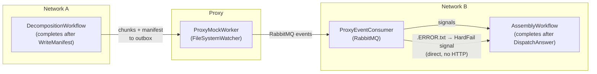
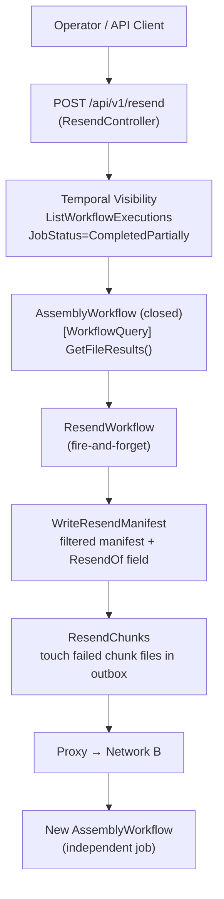

# Manual Resend + Retry Removal

## Part 1 — Remove Chunk Retry Logic & Callback Path

Both `DecompositionWorkflow` and `ResendWorkflow` are **fire-and-forget**: they write files to the outbox and complete. There is no HTTP callback from Network B back to Network A.

### Simplified flow



### `DecompositionWorkflow.cs` — trim to fire-and-forget

Remove: `_callbackReceived`, `FinalStatusReceivedAsync` signal, `WaitConditionAsync`, `_chunkRetryCounts`, `ChunkRetryRequestedAsync` signal, all `MaxRetryCount` references.

After `WriteManifest` the workflow simply returns.

### `AssemblyWorkflow.cs` — remove callback step

Remove the `UpdateClientA` and `NotifyManifestFailure` activity calls. The workflow ends after `DispatchAnswer` (which notifies the original requester, not Network A).

For the manifest-hard-fail early-return path: just return — no network A notification needed.

### Files to delete entirely

- `src/NetworkA/Activities/NetworkA.Activities.Dispatch/Activities/RetryChunkActivity.cs`
- `src/NetworkA/Activities/NetworkA.Activities.Dispatch/Activities/WriteHardFailActivity.cs`
- `src/Shared/Shared.Infrastructure/Options/RetryPolicyOptions.cs`
- `src/NetworkA/NetworkA.Callback.Receiver/` — **entire project** (CallbackController, CallbackService, ICallbackService)
- `src/NetworkB/Activities/NetworkB.Activities.Reporting/Activities/UpdateClientAActivities.cs`
- `src/NetworkB/Activities/NetworkB.Activities.Reporting/Services/NetworkAHttpClient.cs`
- `src/NetworkB/Activities/NetworkB.Activities.Reporting/Interfaces/INetworkAClient.cs`
- `src/Shared/Shared.Infrastructure/Options/NetworkACallbackOptions.cs` (if it exists)

### Files to trim

- `DecompositionConfigLocalActivity.cs` — remove `MaxRetryCount` and `RetryPolicyOptions` DI
- `WorkflowConfiguration.cs` — remove `MaxRetryCount`
- `ProxyEventConsumer.cs` — remove `IHttpClientFactory` + `NetworkACallbackOptions` injections; `.ERROR.txt` branch signals `HardFail` directly; delete `.HARDFAIL.txt` and `.HARDFAIL.txt.ERROR.txt` branches
- `NetworkA.Decomposition.Workflow` host — unregister `RetryChunk`, `WriteHardFail` activities; remove `retry-dispatch-tasks` worker
- `NetworkB.Assembly.Workflow` host — unregister `UpdateClientA`, `NotifyManifestFailure` activities; remove `callback-dispatch-tasks` worker if exclusive to those
- `appsettings.json` (both workflow hosts) — remove retry policy entries, `MaxRetryCount`, `NetworkACallback` config block

---

## Part 2 — Manual Resend Feature (Temporal-native)

### Data flow



### Step 1 — Expose state from `AssemblyWorkflow`

**[`src/NetworkB/NetworkB.Assembly.Workflow/Workflows/AssemblyWorkflow.cs`](src/NetworkB/NetworkB.Assembly.Workflow/Workflows/AssemblyWorkflow.cs)**

- Store `_fileResults` as a field after `AssembleFiles` returns
- Add query handler: `[WorkflowQuery] public List<FileResult> GetFileResults() => _fileResults;`
- Upsert custom search attributes just before the workflow returns:

```csharp
var failedTypes = _fileResults
    .Where(r => r.Status == FileTransferStatus.Failed)
    .Select(r => Path.GetExtension(r.FileName).TrimStart('.'))
    .Distinct().ToList<string>();

TemporalWorkflow.UpsertTypedSearchAttributes(
    TemporalSearchAttributes.JobStatus.ValueSet(finalStatus.ToString()),
    TemporalSearchAttributes.FailedFileTypes.ValueSet(failedTypes),
    TemporalSearchAttributes.JobClosedAt.ValueSet(DateTimeOffset.UtcNow));
```

**New file: `src/Shared/Shared.Contracts/TemporalSearchAttributes.cs`**

```csharp
public static class TemporalSearchAttributes
{
    public static readonly SearchAttributeKey<string> JobStatus =
        SearchAttributeKey.CreateKeyword("JobStatus");
    public static readonly SearchAttributeKey<IList<string>> FailedFileTypes =
        SearchAttributeKey.CreateKeywordList("FailedFileTypes");
    public static readonly SearchAttributeKey<DateTimeOffset> JobClosedAt =
        SearchAttributeKey.CreateDateTimeOffset("JobClosedAt");
}
```

> **Registration**: These three attributes must be registered in the Temporal namespace once before the code runs:

```
> temporal operator search-attribute create --name JobStatus --type Keyword
> temporal operator search-attribute create --name FailedFileTypes --type KeywordList
> temporal operator search-attribute create --name JobClosedAt --type Datetime
>

```

> **Worker requirement**: Querying a closed workflow triggers a full history replay on a Network B worker. The `assembly-workflow` task queue workers **must be running** when the resend API calls `GetFileResults()`. Each closed-workflow query is a replay, so bulk resends of many jobs create proportional replay load on Network B workers.

### Step 2 — Resend API endpoint

**New file: `src/NetworkA/NetworkA.Ingestion.API/Controllers/ResendController.cs`**

```csharp
// POST /api/v1/resend
public record ResendRequest(
    List<string>? JobIds,
    List<string>? FileTypes,    // filter by extension e.g. ["docx", "pdf"]
    List<string>? FileNames,    // filter by specific file name
    DateTime? FromDate,
    DateTime? ToDate);

public record ResendResponse(List<string> StartedResendWorkflowIds);
```

Controller logic:

1. If `JobIds` provided → get each `AssemblyWorkflow` handle directly (`assembly-{jobId}`)
2. Otherwise → `ListWorkflowsAsync` with filter `WorkflowType='AssemblyWorkflow' AND ExecutionStatus='Completed' AND JobStatus='CompletedPartially'` plus optional `FailedFileTypes IN [...]` and `CloseTime` range (`ExecutionStatus='Completed'` scopes to closed executions only, avoiding open workflows)
3. **Skip any workflow whose ID starts with `assembly-resend-`** — resend assemblies are never bulk-resent to prevent double-dispatch. Only original `assembly-{jobId}` workflows are eligible sources. If the operator needs to retry a failed resend, they pass its `JobId` explicitly.
4. Per matched workflow → `GetFileResults()` query → filter to `Failed` status (optionally intersect with `FileNames`)
5. Start one `ResendWorkflow` per job: ID = `resend-{jobId}`, input = `ResendInput(jobId, failedFilePaths)`
6. Return the list of started workflow IDs so the operator can track them in Temporal UI

### Step 3 — `ResendWorkflow` (fire-and-forget)

**New file: `src/NetworkA/NetworkA.Decomposition.Workflow/Workflows/ResendWorkflow.cs`**

```csharp
public record ResendInput(string OriginalJobId, List<string> FileRelativePaths);

[Workflow]
public class ResendWorkflow
{
    [WorkflowRun]
    public async Task RunAsync(ResendInput input)
    {
        // 1. Write filtered resend manifest to manifest outbox
        await TemporalWorkflow.ExecuteActivityAsync(
            "WriteResendManifest", [input], GetOptions(...));

        // 2. Touch chunk files so the proxy FileSystemWatcher re-picks them up
        await TemporalWorkflow.ExecuteActivityAsync(
            "ResendChunks", [input], GetOptions(...));

        // Done — workflow completes. Operator tracks the new AssemblyWorkflow
        // via Temporal UI using ID "assembly-resend-{OriginalJobId}".
    }
}
```

### Step 4 — New activities

**`src/NetworkA/Activities/NetworkA.Activities.Manifest/Activities/WriteResendManifestActivity.cs`**

- Reads `{originalJobId}_manifest.json` from the manifest outbox
- Deserializes to `DecompositionMetadata`, sets `ResendOf = input.OriginalJobId`, filters `Files` to `input.FileRelativePaths`
- Writes `resend-{originalJobId}_manifest.json` to the manifest outbox
- The manifest's job ID is effectively `resend-{originalJobId}` so the new `AssemblyWorkflow` gets ID `assembly-resend-{originalJobId}`

**`src/NetworkA/Activities/NetworkA.Activities.Dispatch/Activities/ResendChunksActivity.cs`**

- Scans the data outbox for chunk files whose names start with `{originalJobId}_` and whose associated file path is in `input.FileRelativePaths`
- Calls `File.SetLastWriteTimeUtc(chunkPath, DateTime.UtcNow)` to re-trigger the proxy watcher

### Step 5 — `ResendOf` correlation field

**[`src/Shared/Shared.Contracts/Models/AssemblyBlueprint.cs`](src/Shared/Shared.Contracts/Models/AssemblyBlueprint.cs)**

- Add `public string? ResendOf { get; set; }` — set when `ParseManifest` reads a resend manifest; lets Network B log/report which original job this resend belongs to. No routing logic needed.

**[`src/Shared/Shared.Contracts/Models/DecompositionMetadata.cs`](src/Shared/Shared.Contracts/Models/DecompositionMetadata.cs)**

- Add `string? ResendOf` parameter so `WriteResendManifestActivity` can embed it in the JSON.

---

## Files Summary

- **Delete projects/files:** `NetworkA.Callback.Receiver/` (whole project), `RetryChunkActivity.cs`, `WriteHardFailActivity.cs`, `RetryPolicyOptions.cs`, `UpdateClientAActivities.cs`, `NetworkAHttpClient.cs`, `INetworkAClient.cs`
- **Trim:** `DecompositionWorkflow.cs`, `AssemblyWorkflow.cs`, `ProxyEventConsumer.cs`, `DecompositionConfigLocalActivity.cs`, `WorkflowConfiguration.cs`, both `appsettings.json`, both workflow host `Program.cs`
- **Extend:** `AssemblyBlueprint.cs`, `DecompositionMetadata.cs`
- **New:** `ResendWorkflow.cs`, `WriteResendManifestActivity.cs`, `ResendChunksActivity.cs`, `ResendController.cs`, `TemporalSearchAttributes.cs`
