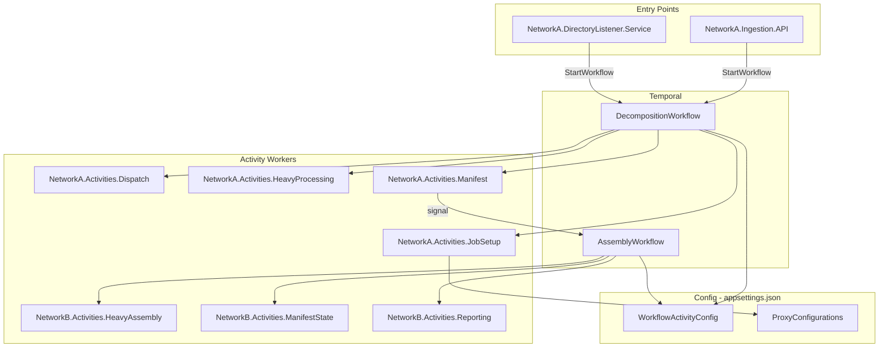

# Remove MongoDB and Redis — Temporal Only

## Why removal is correct

Every use of MongoDB and Redis in this codebase is either redundant or replaceable with zero loss:

- `**Job` in MongoDB — Used only to map a job ID back to its workflow ID (`decomposition-{jobId}`) and retrieve the original request. The workflow ID is deterministic; the original request is already the workflow's input. Temporal already durably stores all this.
- `**AssemblyBlueprint` in MongoDB — The blueprint is returned by `ParseAndPersistManifest` and passed directly as a workflow variable to all downstream activities. MongoDB is pure redundancy here.
- `**WorkflowActivityConfig` in MongoDB + Redis cache — Static operational config (timeouts, retry policies). Belongs in `appsettings.json`, not a live database.
- `**ProxyConfiguration` in MongoDB + Redis cache — Static routing rules. Also belongs in `appsettings.json`.

Removing both databases reduces the dependency surface, eliminates two infrastructure failure modes, and simplifies every service's startup and DI.

## Architecture after removal



## Changes by category

### 1. Delete — MongoDB/Redis infrastructure files

- `[Shared.Infrastructure/Repositories/MongoJobRepository.cs](src/Shared/Shared.Infrastructure/Repositories/MongoJobRepository.cs)`
- `[Shared.Infrastructure/Repositories/MongoWorkflowActivityConfigRepository.cs](src/Shared/Shared.Infrastructure/Repositories/MongoWorkflowActivityConfigRepository.cs)` + `IWorkflowActivityConfigRepository.cs`
- `[Shared.Infrastructure/Cache/RedisWorkflowActivityConfigCache.cs](src/Shared/Shared.Infrastructure/Cache/RedisWorkflowActivityConfigCache.cs)` + `IWorkflowActivityConfigCache.cs`
- `[Shared.Infrastructure/Extensions/MongoDbServiceExtensions.cs](src/Shared/Shared.Infrastructure/Extensions/MongoDbServiceExtensions.cs)`
- `[Shared.Infrastructure/Extensions/RedisServiceExtensions.cs](src/Shared/Shared.Infrastructure/Extensions/RedisServiceExtensions.cs)`
- `[Shared.Infrastructure/Extensions/WorkflowActivityConfigExtensions.cs](src/Shared/Shared.Infrastructure/Extensions/WorkflowActivityConfigExtensions.cs)`
- `[Shared.Infrastructure/Options/MongoDbOptions.cs](src/Shared/Shared.Infrastructure/Options/MongoDbOptions.cs)`
- `[Shared.Infrastructure/Options/RedisOptions.cs](src/Shared/Shared.Infrastructure/Options/RedisOptions.cs)`
- `[NetworkA.Activities.JobSetup/Repositories/MongoProxyConfigRepository.cs](src/NetworkA/Activities/NetworkA.Activities.JobSetup/Repositories/MongoProxyConfigRepository.cs)`
- `[NetworkA.Activities.JobSetup/Cache/RedisProxyConfigCache.cs](src/NetworkA/Activities/NetworkA.Activities.JobSetup/Cache/RedisProxyConfigCache.cs)`
- `[NetworkA.Activities.JobSetup/Interfaces/IProxyConfigCache.cs](src/NetworkA/Activities/NetworkA.Activities.JobSetup/Interfaces/IProxyConfigCache.cs)` + `IProxyConfigRepository.cs`
- `[NetworkB.Activities.ManifestState/Repositories/MongoManifestRepository.cs](src/NetworkB/Activities/NetworkB.Activities.ManifestState/Repositories/MongoManifestRepository.cs)`
- `[NetworkB.Activities.ManifestState/Interfaces/IAssemblyBlueprintRepository.cs](src/NetworkB/Activities/NetworkB.Activities.ManifestState/Interfaces/IAssemblyBlueprintRepository.cs)`
- `[Shared.Contracts/Interfaces/IJobRepository.cs](src/Shared/Shared.Contracts/Interfaces/IJobRepository.cs)`
- `[Shared.Contracts/Models/Job.cs](src/Shared/Shared.Contracts/Models/Job.cs)`
- `[docs/mongo-seed-assembly-workflow.json](docs/mongo-seed-assembly-workflow.json)` + `mongo-seed-decomposition-workflow.json`

### 2. Create — appsettings-backed config providers

- `**Shared.Infrastructure/Options/WorkflowActivityConfigOptions.cs**` — `Dictionary<string, WorkflowActivityConfig> Configs` so both `decomposition-workflow` and `assembly-workflow` keys live in appsettings.json
- `**Shared.Infrastructure/Options/ProxyConfigOptions.cs**` — `List<ProxyConfiguration> Configurations`

### 3. Modify — Shared.Infrastructure core

- `**WorkflowActivityConfigLocalActivity.cs**` — Replace `IWorkflowActivityConfigCache` with `IOptions<WorkflowActivityConfigOptions>`. Read directly from the dictionary by key.
- `**StartupValidator.cs**` — Delete `ValidateMongoDbAsync` and `ValidateRedisAsync`. Keep only `LogTemporalWorkerRegistered`.

### 4. Modify — Services that used IJobRepository

- `**IngestionService.cs**` — Remove `IJobRepository`. Just start the workflow and return the job ID (the GUID is still generated here).
- `**InputSubmissionService.cs**` — Remove the `IJobRepository` scope. Just start the workflow.
- `**CallbackService.cs**` — Derive `workflowId = $"decomposition-{payload.OrigJobId}"` directly. Remove `IJobRepository` and `UpdateStatusAsync` call.

### 5. Modify — Activities that used MongoDB/Redis

- `**RetryChunkActivity.cs**` — Remove `IJobRepository` and the `IncrementChunkRetryCountAsync` call. The workflow's own `_chunkRetryCounts` is the authoritative counter.
- `**JobSetupActivities.cs**` — Remove `IProxyConfigCache`. Inject `IOptions<ProxyConfigOptions>`. Accept source/target paths as parameters (not a jobId DB lookup).
- `**ParseAndPersistManifestActivities.cs**` — Remove `IAssemblyBlueprintRepository`. Delete the `UpsertAsync` call; the blueprint is already returned to the workflow.
- `**UpdateBlueprintStatusActivities.cs**` — Remove `IAssemblyBlueprintRepository`. Keep only the log line (activity becomes pure observability).

### 6. Modify — Workflows

- `**DecompositionWorkflow.cs**` — Change `FetchConfiguration` call: pass `request.SourcePath` and `request.TargetPath` (from the workflow's own input parameter) instead of just `jobId`. Update activity args to match new `JobSetupActivities` signature.

### 7. Modify — All Program.cs files

Remove from each relevant host:

- `Configure<MongoDbOptions>` / `AddMongoDb()`
- `Configure<RedisOptions>` / `AddRedis()`
- `AddWorkflowActivityConfig()`
- `IJobRepository` / `MongoJobRepository` registration
- `IAssemblyBlueprintRepository` / `MongoManifestRepository` registration
- `StartupValidator.ValidateMongoDbAsync` / `ValidateRedisAsync` calls

Add where needed:

- `Configure<WorkflowActivityConfigOptions>` + register local activity
- `Configure<ProxyConfigOptions>` (JobSetup worker only)

### 8. Modify — .csproj files

Remove `<PackageReference>` for `MongoDB.Driver` from:

- `Shared.Infrastructure.csproj`
- `NetworkA.Ingestion.API.csproj`
- `NetworkA.Callback.Receiver.csproj`
- `NetworkA.Activities.JobSetup.csproj`
- `NetworkB.Activities.ManifestState.csproj`

Remove `<PackageReference>` for `StackExchange.Redis` from:

- `Shared.Infrastructure.csproj`
- `NetworkA.Activities.JobSetup.csproj`

### 9. Modify — appsettings.json (all services)

Remove `MongoDB` and `Redis` sections. Add to workflow hosts and JobSetup worker:

```json
"WorkflowActivityConfig": {
  "Configs": {
    "decomposition-workflow": {
      "Activities": {
        "FetchConfiguration": { "StartToCloseMinutes": 2 },
        "PrepareSource":      { "StartToCloseMinutes": 10, "HeartbeatSeconds": 30 }
      }
    }
  }
},
"ProxyConfigurations": {
  "Configurations": [
    { "SourceFormat": "zip", "TargetQueue": "..." }
  ]
}
```

### 10. Modify — docker-compose.yml

Remove the `mongo` and `redis` service blocks entirely.
