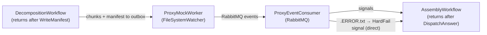

# Part 1 — Remove Chunk Retry Logic & Callback Path

## Goal

After this change:

- `DecompositionWorkflow` writes the manifest and returns — no waiting, no retry signals.
- `AssemblyWorkflow` ends after `DispatchAnswer` — no Network A notification.
- Network B signals `HardFail` directly instead of posting to the Network A HTTP callback.

---

## Files to Delete

- [`src/NetworkA/Activities/NetworkA.Activities.Dispatch/Activities/RetryChunkActivity.cs`](src/NetworkA/Activities/NetworkA.Activities.Dispatch/Activities/RetryChunkActivity.cs)
- [`src/NetworkA/Activities/NetworkA.Activities.Dispatch/Activities/WriteHardFailActivity.cs`](src/NetworkA/Activities/NetworkA.Activities.Dispatch/Activities/WriteHardFailActivity.cs)
- [`src/Shared/Shared.Infrastructure/Options/RetryPolicyOptions.cs`](src/Shared/Shared.Infrastructure/Options/RetryPolicyOptions.cs)
- [`src/Shared/Shared.Infrastructure/Options/NetworkACallbackOptions.cs`](src/Shared/Shared.Infrastructure/Options/NetworkACallbackOptions.cs)
- [`src/NetworkA/NetworkA.Callback.Receiver/`](src/NetworkA/NetworkA.Callback.Receiver/) — entire project (`CallbackController`, `CallbackService`, `ICallbackService`, `ChunkRetryRequest`, etc.)
- [`src/NetworkB/Activities/NetworkB.Activities.Reporting/Activities/UpdateClientAActivities.cs`](src/NetworkB/Activities/NetworkB.Activities.Reporting/Activities/UpdateClientAActivities.cs)
- [`src/NetworkB/Activities/NetworkB.Activities.Reporting/Services/NetworkAHttpClient.cs`](src/NetworkB/Activities/NetworkB.Activities.Reporting/Services/NetworkAHttpClient.cs)
- [`src/NetworkB/Activities/NetworkB.Activities.Reporting/Interfaces/INetworkAClient.cs`](src/NetworkB/Activities/NetworkB.Activities.Reporting/Interfaces/INetworkAClient.cs)

---

## Files to Trim

### [`src/NetworkA/NetworkA.Decomposition.Workflow/Workflows/DecompositionWorkflow.cs`](src/NetworkA/NetworkA.Decomposition.Workflow/Workflows/DecompositionWorkflow.cs)

Remove:

- Fields: `_callbackReceived`, `_chunkRetryCounts`
- Signal handlers: `FinalStatusReceivedAsync`, `ChunkRetryRequestedAsync`
- `WaitConditionAsync(() => _callbackReceived)` call
- All `MaxRetryCount` references when building `WorkflowConfiguration`
- Activity calls to `RetryChunk` / `WriteHardFail`

Result: after `WriteManifest`, the workflow simply returns.

### [`src/NetworkB/NetworkB.Assembly.Workflow/Workflows/AssemblyWorkflow.cs`](src/NetworkB/NetworkB.Assembly.Workflow/Workflows/AssemblyWorkflow.cs)

Remove:

- `UpdateClientA` activity call at the end of the happy path
- `NotifyManifestFailure` activity call in the manifest hard-fail branch

Result: manifest hard-fail path just returns; happy path ends after `DispatchAnswer`.

### [`src/NetworkB/NetworkB.ProxyListener.Service/Consumers/ProxyEventConsumer.cs`](src/NetworkB/NetworkB.ProxyListener.Service/Consumers/ProxyEventConsumer.cs)

Remove:

- `IHttpClientFactory` and `NetworkACallbackOptions` constructor injections
- HTTP POST to `/api/v1/callbacks/retry` for the ordinary `.ERROR.txt` branch

Change:

- `.ERROR.txt` branch (non-`.HARDFAIL` stem): signal `HardFail` directly on the `AssemblyWorkflow` instead of calling Network A
- Remove the `.HARDFAIL.txt`-stem special-case branch (now redundant)

### [`src/NetworkA/NetworkA.Decomposition.Workflow/Activities/DecompositionConfigLocalActivity.cs`](src/NetworkA/NetworkA.Decomposition.Workflow/Activities/DecompositionConfigLocalActivity.cs)

Remove:

- `IOptions<RetryPolicyOptions>` constructor injection
- `MaxRetryCount` field from `DecompositionRuntimeConfig` and from the `FetchAsync` return value

### [`src/Shared/Shared.Contracts/Models/WorkflowConfiguration.cs`](src/Shared/Shared.Contracts/Models/WorkflowConfiguration.cs)

Remove:

- `MaxRetryCount` parameter from the record

### [`src/NetworkA/Activities/NetworkA.Activities.Dispatch/Program.cs`](src/NetworkA/Activities/NetworkA.Activities.Dispatch/Program.cs)

Remove:

- Entire `retry-dispatch-tasks` worker registration (`RetryChunkActivity`, `WriteHardFailActivity`)
- Any `RetryPolicyOptions` DI binding

### [`src/NetworkB/Activities/NetworkB.Activities.Reporting/Program.cs`](src/NetworkB/Activities/NetworkB.Activities.Reporting/Program.cs)

Remove:

- `Configure<NetworkACallbackOptions>(...)`
- `AddHttpClient("NetworkA")`
- `AddScoped<INetworkAClient, NetworkAHttpClient>()`
- `.AddScopedActivities<UpdateClientAActivities>()` from the `callback-dispatch-tasks` worker

Note: `WriteCsvReportActivities` and `DispatchAnswerActivities` remain on `callback-dispatch-tasks`.

### [`src/NetworkA/NetworkA.Decomposition.Workflow/Program.cs`](src/NetworkA/NetworkA.Decomposition.Workflow/Program.cs)

Remove:

- `Configure<RetryPolicyOptions>(...)` binding (or the entire `RetryPolicy` config section binding)

### [`src/NetworkA/NetworkA.Decomposition.Workflow/appsettings.json`](src/NetworkA/NetworkA.Decomposition.Workflow/appsettings.json)

Remove:

- `RetryPolicy` / `MaxRetryCount` section
- `RetryChunk` and `WriteHardFail` entries from `WorkflowActivityConfig`

### [`src/NetworkB/NetworkB.Assembly.Workflow/appsettings.json`](src/NetworkB/NetworkB.Assembly.Workflow/appsettings.json)

Remove:

- `NotifyManifestFailure` and `UpdateClientA` entries from activity config

### [`Dintinct.slnx`](Dintinct.slnx)

Remove:

- `<Project Path="src/NetworkA/NetworkA.Callback.Receiver/NetworkA.Callback.Receiver.csproj" />` entry
